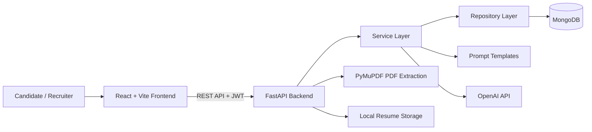

# 🚀 NipunHire AI

> An explainable AI platform for resume intelligence, job matching, and recruitment workflows.


---

## 📌 Overview

NipunHire AI is a full-stack recruitment and career-growth platform for candidates and recruiters. It provides PDF resume ingestion, structured resume intelligence, AI-assisted screening, explainable resume-to-job matching, job and application management, interview workflows, and career-development tools.

The platform treats automated outputs as decision-support signals. Its explainability focus is expressed through structured results: resume analysis exposes strengths, weaknesses, skill categories, and improvement suggestions; explainable matching returns named score factors, their point contributions, supporting reasons, and a recommendation derived from the audited result.

## 🎬 Quick Demo / Screenshots

<!-- Add product screenshots or a short demo GIF here when they are available. -->

### 🎯 Objectives

- Turn uploaded PDF resumes into structured candidate profiles for review and follow-up workflows.
- Help candidates assess resume quality and role fit through structured screening and skill-gap analysis.
- Give recruiters a central workspace for jobs, candidates, applications, interviews, and pipeline views.
- Support candidate development through goals, coding practice, notifications, and career coaching.

---

## ✨ Features

### 🔐 Authentication and Account Management

- User registration and login
- JWT access-token and refresh-token workflow
- Protected frontend routes and authenticated API endpoints
- Profile editing, password changes, and account settings

### 📄 Resume Intelligence

- PDF-only resume upload with file-type validation and a 5 MB size limit
- Text and page-count extraction with PyMuPDF
- OpenAI-backed, schema-validated parsing into a structured candidate profile
- AI-generated professional summary, candidate screening, skill categorisation, and resume-improvement suggestions
- Resume history, retrieval, and deletion
- A legacy ATS-style scorecard is still returned by the resume API, but the current upload pipeline does not populate it; use the screening endpoint for the implemented AI analysis.

### 🎯 Job Matching and Explainability

- Create jobs with required and optional skills
- Compare a candidate resume to a job through the existing scorecard endpoint
- Run AI-assisted explainable matching against a parsed resume profile
- Return an overall match percentage, missing skills, factor-level point contributions, and reasons
- Derive a Hire, Maybe, or Reject recommendation deterministically from the explainable result
- Persist match records for later review

### 💼 Recruitment Workflow

- Create, browse, update, and delete job listings
- Submit and track applications
- Candidate screening and match-card interface
- Role-aware recruiter and candidate dashboards
- Analytics summary and recruitment pipeline view
- Interview creation, listing, and submission workflows

### 📈 Career Growth Workspace

- Career goals and progress tracking
- Coding-question and submission workflow
- AI career plans grounded in existing profiles, screening outputs, and recent matches, with saved history
- Review-only AI resume-rewrite suggestions that retain the submitted original text for comparison
- Review-only ATS keyword and phrasing suggestions grounded in a selected target job
- Notification centre with unread tracking and bulk actions

---

## 🛠 Tech Stack

| Category | Technologies | Usage |
| --- | --- | --- |
| **Frontend** | React 19, TypeScript, Vite | Single-page web application |
| **UI & Styling** | Tailwind CSS, Base UI, Lucide React, Sonner | Components, styling, icons, and notifications |
| **Frontend Data** | TanStack React Query, Zustand, Axios | Server-state caching, auth state, and API requests |
| **Backend** | Python 3.14, FastAPI, Pydantic | REST API and request/response validation |
| **Database** | MongoDB, Motor, Beanie | Asynchronous document persistence and models |
| **Authentication** | JWT, Passlib, bcrypt, python-jose | Password hashing and token-based access |
| **Resume Processing** | PyMuPDF, OpenAI SDK, Pydantic | PDF text extraction and structured AI responses |
| **Development** | npm, Vite, Uvicorn | Frontend tooling and local API server |

---

## 📂 Project Structure

```text
NipunHire AI/
├── README.md
├── LICENSE
├── requirements.txt
├── backend/
│   ├── .env.example           # Backend environment template
│   ├── app/
│   │   ├── ai/                # AI client and supporting utilities
│   │   ├── api/               # FastAPI endpoint modules
│   │   ├── core/              # Configuration, security, dependencies
│   │   ├── db/                # MongoDB setup
│   │   ├── models/            # Beanie document models
│   │   ├── repositories/      # Database access layer
│   │   ├── schemas/           # Pydantic request/response contracts
│   │   ├── services/          # Business logic and workflows
│   │   └── prompts/           # AI prompt templates
│   └── tests/                 # Backend unit tests
└── frontend/
    ├── .env.example           # Frontend environment template
    ├── public/                # Static assets
    ├── src/
    │   ├── app/               # Routing and providers
    │   ├── features/          # Feature-based pages and components
    │   └── shared/            # Shared UI, API clients, and utilities
    └── package.json
```

### 🏗 Architecture



The backend separates HTTP routers, services, repositories, document models, and Pydantic schemas. The resume pipeline stores the uploaded PDF locally, extracts its text with PyMuPDF, and sends only the required text or structured profile data to the AI service for the relevant stage.

---

## 🚀 Getting Started

### Prerequisites

- Python 3.14+
- Node.js 20+ and npm
- MongoDB (local or hosted)
- An OpenAI API key for resume parsing, screening, and explainable matching
- Git

### 1. Clone the repository

```bash
git clone <your-repository-url>
cd <repository-directory>/"NipunHire AI"
```

### 2. Configure the backend

```bash
python -m venv .venv
```

Activate the virtual environment:

```bash
# Windows PowerShell
.venv\Scripts\Activate.ps1

# macOS / Linux
source .venv/bin/activate
```

Install dependencies and copy the environment template:

```bash
pip install -r requirements.txt

# Windows PowerShell
Copy-Item backend/.env.example backend/.env

# macOS / Linux
cp backend/.env.example backend/.env
```

Set the required backend variables in `backend/.env`, then start the API:

```bash
cd backend
uvicorn app.main:app --reload
```

The API runs at `http://localhost:8000`.

### 3. Configure the frontend

Open a new terminal in `NipunHire AI/frontend`:

```bash
npm install
```

Copy the frontend environment template:

```bash
# Windows PowerShell
Copy-Item .env.example .env

# macOS / Linux
cp .env.example .env
```

Start the frontend:

```bash
npm run dev
```

Vite normally serves the application at `http://localhost:5173`.

### Environment Variables

Copy each `.env.example` file before setting values. Do not commit `.env` files or place production secrets in source control.

#### Backend (`backend/.env`)

| Variable | Description |
| --- | --- |
| `PROJECT_NAME` | Application name shown in backend metadata. |
| `VERSION` | Application version shown in backend metadata. |
| `ENVIRONMENT` | Deployment environment label, such as `development`, `staging`, or `production`. |
| `NIPUNHIRE_DEBUG` | Enables or disables the backend debug setting. |
| `MONGODB_URI` | Connection string for the MongoDB instance. |
| `DATABASE_NAME` | MongoDB database used by the application. |
| `JWT_SECRET` | Secret used to sign and verify JWTs; set a long, random value. |
| `JWT_ALGORITHM` | JWT signing algorithm; defaults to `HS256` when empty. |
| `ACCESS_TOKEN_EXPIRE_MINUTES` | Lifetime, in minutes, of access tokens. |
| `REFRESH_TOKEN_EXPIRE_DAYS` | Lifetime, in days, of refresh tokens. |
| `GEMINI_API_KEY` | Reserved configuration for Gemini; it is not used by the current AI service. |
| `OPENAI_API_KEY` | API key used by the current resume parsing, screening, and explainable matching service. |
| `OPENAI_MODEL` | OpenAI model identifier used for structured AI responses. |
| `OPENAI_REQUEST_TIMEOUT_SECONDS` | Per-request timeout, in seconds, for OpenAI requests. |
| `OPENAI_MAX_RETRIES` | Maximum number of attempts for retryable OpenAI request failures. |
| `ALLOWED_ORIGINS` | JSON list of browser origins allowed by CORS. |

#### Frontend (`frontend/.env`)

| Variable | Description |
| --- | --- |
| `VITE_API_BASE_URL` | Base URL, including `/api/v1`, used by the frontend API client. |

---

## 📖 Documentation

### API Documentation

After starting the backend, FastAPI provides interactive API documentation:

| Resource | URL |
| --- | --- |
| Swagger UI | `http://localhost:8000/docs` |
| ReDoc | `http://localhost:8000/redoc` |

All application API routes use the `/api/v1` prefix. Authenticated endpoints require an `Authorization: Bearer <access-token>` header.

### API Modules

| Module | Base path | Purpose |
| --- | --- | --- |
| Authentication | `/auth` | Registration, login, refresh tokens, and account information |
| Jobs | `/jobs` | Job creation and management |
| Resumes | `/resumes` | PDF upload, AI parsing, screening, history, and deletion |
| Matching | `/matching` | Resume-to-job comparison and explainable profile matching |
| Applications | `/applications` | Application creation, status updates, and listing |
| Profile and Settings | `/profile`, `/settings` | Candidate profile and account preferences |
| Dashboard | `/dashboard` | Candidate dashboard data |
| Interviews | `/interviews` | Interview creation, listing, and submission |
| Goals | `/goals` | Career goals and progress |
| Coding | `/coding` | Coding questions and submissions |
| Coach | `/career-coach` | Career-coach requests, AI plans, and history |
| Candidate Intelligence | `/candidate-intelligence` | Review-only resume and ATS optimization suggestions |
| Notifications | `/notifications` | Notification read and unread state |

### How the Analysis Works

1. A candidate uploads a PDF resume.
2. The backend validates it, stores it locally, and uses PyMuPDF to extract text and page count.
3. The OpenAI-backed parser converts the extracted text into a validated structured profile.
4. A second structured AI response creates the professional summary and career snapshot.
5. The screening endpoint can then generate strengths, weaknesses, ATS-compatibility assessment, skill categories, and improvement suggestions from the structured profile.
6. The explainable matching endpoint compares that profile with a job and requires named factor contributions to reconcile exactly with its overall match score.

> Scores and recommendations are decision-support signals only. Human review must remain part of every hiring decision.

### Development Commands

| Directory | Command | Description |
| --- | --- | --- |
| `frontend` | `npm run dev` | Start the frontend development server |
| `frontend` | `npm run build` | Type-check and create a production build |
| `frontend` | `npm run lint` | Run frontend linting |
| `backend` | `uvicorn app.main:app --reload` | Start the backend in development mode |
| `backend` | `python -m unittest discover -s tests` | Run the backend test suite |

---

## 🧪 Research

The `research data/` directory at the repository root contains reference material used while designing the platform's recruitment, resume-screening, and AI-assistance workflows.

The core research contribution under development is an explainability approach for job matching: instead of presenting only a score, the system requires factor-level contributions and reasons whose arithmetic reconciles with the overall match percentage. This is intended to support inspection and human review; it is not a claim of validated fairness, accuracy, or hiring efficacy.

Current research direction includes:

- Explainable decision support in recruitment systems
- Resume parsing and ATS compatibility evaluation
- Fairness, privacy, and human oversight in AI-assisted hiring
- Structured skill matching and adaptive interview assessment

---

## 🗺 Roadmap

- [x] FastAPI backend with MongoDB persistence
- [x] React/Vite frontend with protected routes
- [x] Authentication and profile management
- [x] Job management, applications, and candidate matching
- [x] PDF resume ingestion and OpenAI-backed structured parsing
- [x] AI resume screening and explainable factor-level profile-to-job matching
- [x] Candidate intelligence: AI career plans plus review-only resume and ATS suggestions
- [x] Interview, goals, coding, coaching, and notifications modules
- [x] Backend unit tests for AI, prompt, resume-intelligence, screening, and matching services
- [ ] Frontend automated test suite
- [ ] CI/CD pipeline
- [ ] Production deployment configuration
- [ ] Managed object storage for uploaded resumes
- [ ] AI evaluation, guardrails, and production monitoring
- [ ] Advanced semantic matching and recruiter reporting

---

## 🤝 Contributing

Contributions are welcome.

1. Fork the repository.
2. Create a feature branch: `git checkout -b feature/your-feature`.
3. Make and test your changes.
4. Commit with a clear message.
5. Open a pull request explaining the change and how it was tested.

Please do not commit `.env` files, API keys, JWT secrets, private resumes, or other personal candidate data.

---

## 📜 License

Licensed under the Apache License 2.0.
