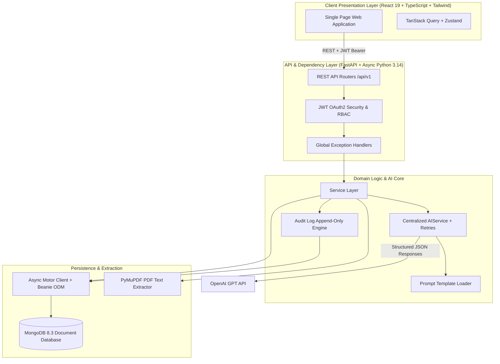

<div align="center">

# 🚀 NipunHire AI
### *Autonomous Explainable AI Hiring, Candidate Evaluation & Research Platform*

[](LICENSE)
[](https://python.org)
[](https://fastapi.tiangolo.com)
[](https://react.dev)
[](https://mongodb.com)

---

[✨ Overview](#-overview) •
[🏗️ Architecture](#️-architecture) •
[⚡ Platform Modules](#-platform-modules) •
[🚀 Quick Start](#-quick-start) •
[📊 API Modules](#-api-modules) •
[🧪 Testing & Quality](#-testing--quality) •
[🔬 Research & Ethics](#-research--ethics) •
[⚠️ Known Limitations](#️-known-limitations) •
[🗺️ Roadmap](#️-roadmap)

---

</div>

## 📌 Overview

**NipunHire AI** is an enterprise-grade, full-stack recruitment and candidate intelligence platform powered by transparent, audit-ready AI models. It bridges candidate career acceleration with recruiter decision support by replacing opaque black-box AI scores with **auditable factor contributions, mathematical reconciliation, and ethical human-in-the-loop disclaimers**.

```
📄 PDF Resume Processing  ──▶  🎯 Factor Match & Screening  ──▶  🎙️ Adaptive AI Interview
                                                                       │
🔬 Process Bias & Fraud Audit  ◀──  📊 Recruiter Ranking & Decision ◀──  💻 Static Code Review
```

> [!IMPORTANT]
> **Human-in-the-Loop AI Directive**: All AI outputs across NipunHire AI—from match percentages to interview cheat risk flags—are decision-support signals designed for human evaluation. Automated systems never issue final employment decisions or candidate rejections independently.

---

## 🏗️ Architecture



---

## ⚡ Platform Modules

<details open>
<summary><b>📄 Phase 1–3: Resume Intelligence & ATS Compatibility</b></summary>
<br>

* 📥 **PDF Resume Ingestion**: Validated 5 MB PDF uploads with local storage and PyMuPDF text extraction.
* 🧠 **OpenAI Schema-Validated Parsing**: Converts unformatted resume text into structured candidate profile entities.
* 🔍 **AI Screening & ATS Feedback**: Evaluates strengths, weaknesses, category skills, and actionable improvement recommendations.
* 📜 **Resume History & Management**: Full retrieval, profile update, and soft/hard deletion workflows.

</details>

<details open>
<summary><b>🎯 Phase 4–5: Explainable Job Matching & Candidate Intelligence</b></summary>
<br>

* ⚖️ **Explainable Factor Matching**: Reconciles individual named point contributions strictly to sum to the overall match score percentage.
* 🤖 **Deterministic Recommendations**: Generates `Hire`, `Maybe`, or `Reject` candidate signals based on reconciled factor arithmetic.
* 📈 **AI Career Plans & Guidance**: Tailored career growth blueprints grounded in existing candidate profile data.
* 📝 **Review-Only ATS & Resume Rewrites**: Review-only optimization suggestions retaining original submitted text for side-by-side comparison.

</details>

<details open>
<summary><b>🎙️ Phase 6: Adaptive AI Interview Simulation</b></summary>
<br>

* 🔄 **Stateful Multi-Turn Sessions**: Tracks question history, difficulty levels, candidate turns, and session lifecycle (`in_progress`, `ready_to_complete`, `completed`, `abandoned`).
* 📊 **5-Dimension Turn Evaluation**: Scores technical correctness, communication clarity, problem-solving depth, behavioral alignment, and experience relevance per turn.
* 🔐 **Ownership Authorization**: Enforces candidate ownership checks (unauthorized access returns `404 Not Found` to prevent resource probing).
* 🎯 **Benchmark Comparisons**: Aggregates final reports with ideal answer comparisons and overall performance scores.

</details>

<details open>
<summary><b>💻 Phase 7: Coding AI & Static Code Review</b></summary>
<br>

* 🧩 **AI Question Generation**: Generates problem statements, input/output constraints, test cases, and starter code tailored to job technologies and difficulty levels.
* 🛡️ **Static Code Review (No Sandbox Execution)**: Analyzes submitted plain-text code for correctness, edge cases, Big-O time complexity, space complexity, and code quality.
* ⚠️ **Syntax Validity Checks**: Detects incomplete snippets or syntax defects, flagging `is_incomplete_or_invalid: true` rather than guessing execution outcomes.
* 📋 **Consolidated Feedback View**: Unifies question specification, candidate source code, and AI review analysis in a single endpoint.

</details>

<details open>
<summary><b>📊 Phase 8: Recruiter AI & Decision Support</b></summary>
<br>

* 📝 **Candidate Summary Reports**: Synthesizes multi-phase evaluations (resume match, interview report, coding review) into recruiter-facing executive summaries.
* 🔀 **Side-by-Side Candidate Comparison**: Generates side-by-side matrices ranking relative strengths and dimension leaders across candidate pools.
* 🔢 **Deterministic Candidate Ranking**: Ranks candidates using configurable sub-score weights (`match_weight`, `interview_weight`, `coding_weight`) with dynamic weight normalization for missing evaluations.
* ✍️ **AI Rank Justifications**: Generates concise natural language justifications per rank position based on computed scores.
* 💡 **Aggregate Hiring Recommendations**: Formulates final `Hire`, `Maybe`, or `Reject` decisions with grounded reasoning.
* 📑 **Job Description Generator**: Auto-generates structured job descriptions (summary, responsibilities, required and preferred qualifications) from role titles and skills.

</details>

<details open>
<summary><b>🔬 Phase 9: Research Features & Ethics Auditing</b></summary>
<br>

* 🔍 **Unified Explanation Traces**: Consolidates match factor breakdowns, interview dimensions, and coding reviews into a single trace with deterministic cross-phase consistency metrics.
* 🛡️ **Statistical Process Bias Auditing**: Calculates score distributions (mean, median, std dev, min/max), high variance flags, and single-factor rejection dominance across applicant pools. **Contains ZERO protected demographic attribute collection or profiling.**
* ⚠️ **Resume Internal Consistency Audit**: Checks stated resume text for timeline overlaps, unsupported skill claims, and date contradictions.
* 🕵️ **Interview Stylometric Cheat Risk Detection**: Analyzes Q&A history for phrasing shifts and unnatural polish. Informational-only; never auto-disqualifies candidates.
* ⚖️ **Mandatory Ethical Disclaimers**: Every research response includes a non-empty `human_review_disclaimer` field framing outputs as decision-support signals.

</details>

<details open>
<summary><b>🔒 Production Readiness & Audit Trail</b></summary>
<br>

* 🛡️ **RateLimiterMiddleware**: Sliding-window rate limiter tracking requests per IP to protect auth & expensive AI routes.
* 📜 **Immutable Append-Only Audit Trail**: Automatically records recruiter hiring recommendations, candidate status changes, and process bias audit queries.

</details>

---

## 🛠️ Tech Stack

| Domain | Tooling & Frameworks | Description |
| :--- | :--- | :--- |
| **Backend Core** |    | High-performance asynchronous REST API and strict schema validation |
| **Database** |   | Async Motor MongoDB client with Beanie ODM document models |
| **AI Foundation** |  PyMuPDF | Structured JSON response parsing, prompt loader, and PDF text extraction |
| **Frontend UI** |    | Modern SPA frontend with TanStack React Query & Zustand state management |
| **Styling & UI** |  Lucide React Sonner | Glassmorphism UI components, dynamic icons, and toast notifications |

---

## 🚀 Quick Start

### Prerequisites

* **Python 3.14+**
* **Node.js 20+** and `npm`
* **MongoDB** (Local instance or MongoDB Atlas)
* **OpenAI API Key**

### Step 1: Clone Repository

```bash
git clone https://github.com/aniksam-github/NipunHire-AI.git
cd NipunHire-AI
```

### Step 2: Backend Setup

```bash
# Create and activate virtual environment
python -m venv .venv

# Windows PowerShell
.venv\Scripts\Activate.ps1
# Linux/macOS
source .venv/bin/activate

# Install dependencies
pip install -r requirements.txt

# Copy environment template
cp backend/.env.example backend/.env
```

Configure `backend/.env`:
```env
MONGODB_URI=mongodb://localhost:27017
DATABASE_NAME=nipunhire_db
JWT_SECRET=your-super-secret-jwt-key
OPENAI_API_KEY=sk-proj-your-openai-api-key
OPENAI_MODEL=gpt-4o-mini
```

Start Backend Server:
```bash
cd backend
uvicorn app.main:app --reload
```
Backend API will run live at `http://localhost:8000`.

### Step 4: Docker & Nginx Horizontal Scaling (Load Balanced Setup)

Launch multiple backend replicas behind an Nginx round-robin reverse proxy load balancer:

```bash
# Start Nginx load balancer, MongoDB, and 3 FastAPI backend replicas
docker-compose up --build --scale backend=3 -d

# Verify container status
docker-compose ps
```

- **Nginx Load Balancer**: Listens externally at `http://localhost:8000` (proxying traffic across `http://backend:8000` replicas).
- **Backend Port Isolation**: Backend container ports are isolated on `nipunhire-network` and are not directly exposed to the host machine.
- **Automated Health Checks**: Container health checks (`/health`) ensure traffic is only routed to ready and healthy backend instances.

---

## 📊 API Modules

FastAPI automatically generates interactive API documentation:
* **Swagger UI**: [`http://localhost:8000/docs`](http://localhost:8000/docs)
* **ReDoc**: [`http://localhost:8000/redoc`](http://localhost:8000/redoc)

| Module | Base Path | Key Features | Auth Guard |
| :--- | :--- | :--- | :---: |
| **Auth** | `/api/v1/auth` | Login, registration, JWT token refresh | Public |
| **Jobs** | `/api/v1/jobs` | Job post creation, listing, updates, deletion | Authenticated |
| **Resumes** | `/api/v1/resumes` | PDF upload, PyMuPDF text extraction, AI screening | Authenticated |
| **Matching** | `/api/v1/matching` | Explainable factor matching & point contribution audit | Authenticated |
| **Interviews** | `/api/v1/interviews` | Multi-turn adaptive interviews, difficulty shifts, reports | Authenticated |
| **Coding** | `/api/v1/coding` | Challenge generation, plain-text code submission, static AI review | Authenticated |
| **Recruiter AI** | `/api/v1/recruiter` | Candidate summary, side-by-side comparison, candidate ranking | Recruiter / Admin |
| **Research** | `/api/v1/research` | Explanation traces, statistical process bias audits, cheat risk checks | Recruiter / Admin |
| **Audit Logs** | `/api/v1/audit-logs` | Read-only append-only audit trail for candidate/job decisions | Recruiter / Admin |

---

## 🧪 Testing & Quality

The backend test suite covers schema validation, service workflows, deterministic ranking algorithms, statistical bias auditing, and role authorization.

```bash
# Run full backend unit & integration test suite
cd backend
python -m unittest discover -s tests
```

```text
Ran 94 tests in 2.020s

OK
```

> [!NOTE]
> All unit tests execute deterministically without making live network calls to external LLM providers.

### 🎯 AI Feature Evaluation Pipeline

NipunHire AI includes an enterprise developer evaluation pipeline to measure output quality against a fixed golden dataset of **17 structured test cases** across **resume parsing**, **resume matching**, and **resume screening**. It prevents prompt regressions before shipping changes.

#### **Key Features**:
* **Golden Dataset**: 17 structured test cases (`backend/eval/dataset/`) containing sample resume texts, job descriptions, and human-defined criteria.
* **Dual Check Strategy**:
  1. **Deterministic Checks**: Validates numeric score ranges, required fields, custom field matching rules, and skill/keyword occurrences.
  2. **AI-Judge Check**: Reuses `AIService` to grade output reasoning coherence and technical specificity on a 1-5 rubric.
* **Token & Cost Tracking**: Accumulates exact prompt + completion tokens captured by `AIService` and calculates estimated run cost ($ USD).
* **Persistence & Trend Analysis**: Saves run reports to `backend/eval/runs/` and compares latest run against previous runs to highlight pass rate trends, recoveries, and regressions.

#### **Running the Evaluation CLI**:

```bash
cd backend

# Run complete evaluation pipeline (all 17 test cases)
python -m eval.run_evaluation

# Run evaluation for a specific AI feature
python -m eval.run_evaluation --feature resume_matching

# Fast deterministic-only evaluation (skips AI judge LLM calls)
python -m eval.run_evaluation --skip-judge

# Detailed output per test case
python -m eval.run_evaluation --verbose
```

#### **Sample Evaluation Report**:
```text
================================================================================
 NIPUNHIRE AI FEATURE EVALUATION REPORT 
================================================================================
Run ID:         run_20260804_075848
Timestamp:      2026-08-04T07:58:48.438406+00:00
Model Version:  gpt-4o-mini
Duration:       3.89 seconds
--------------------------------------------------------------------------------
FEATURE SUMMARY:
  * resume_matching     : 6/6 passed (100.0%)
  * resume_parsing      : 6/6 passed (100.0%)
  * resume_screening    : 5/5 passed (100.0%)
--------------------------------------------------------------------------------
AGGREGATE METRICS:
  * Total Test Cases : 17
  * Passed Cases     : 17
  * Failed Cases     : 0
  * Aggregate Pass Rate: 100.00%

TOKEN USAGE & COST ESTIMATION:
  * Prompt Tokens    : 7,650
  * Completion Tokens: 3,740
  * Total Tokens     : 11,390
  * Estimated Cost   : $0.003391 USD
--------------------------------------------------------------------------------
HISTORICAL COMPARISON (vs Previous Run):
  * Previous Pass Rate: 100.00%
  * Pass Rate Change  : +0.00%
  * Regressions: None
================================================================================
```

#### **Adding New Golden Test Cases**:
To add a new golden test case, simply add a JSON entry to the appropriate file in `backend/eval/dataset/` (`parsing_cases.json`, `matching_cases.json`, or `screening_cases.json`) without modifying runner code:

```json
{
  "id": "match_007_custom_role",
  "feature": "resume_matching",
  "description": "Description of candidate and target job",
  "input": {
    "resume_text": "Sample resume text...",
    "job_details": {
      "title": "Backend Engineer",
      "required_skills": ["Python", "FastAPI"]
    }
  },
  "expected_criteria": {
    "score_range": {"min": 80, "max": 100, "field": "overall_match_percentage"},
    "non_empty_fields": ["overall_match_percentage", "factors"],
    "required_keywords": ["Python", "FastAPI"],
    "ai_judge_rubric": {
      "aspects": ["reasoning_coherence", "specificity"],
      "min_score": 4
    }
  }
}
```

---

## 🔬 Research & Ethics

The `research data/` directory contains foundational literature and design specifications driving NipunHire AI's algorithmic transparency.

### **Core Academic Contributions**:
1. **Explainable Point Reconciliation**: Point contributions of individual match factors are mathematically constrained to sum exactly to overall match percentages.
2. **Process Audit vs Demographic Profiling**: Evaluates score variance ($\sigma^2$) and single-factor dominance across candidate pools **without collecting, inferring, or storing protected demographic attributes (race, gender, age, etc.)**.
3. **Internal Consistency Audits**: Evaluates timeline logic and stated claim internal consistency without claiming external background check verification.
4. **Human-in-the-Loop Disclaimers**: Every response schema in Phase 9 includes explicit non-empty `human_review_disclaimer` fields confirming that AI outputs are advisory signals.

---

## ⚠️ Known Limitations

1. **In-Memory Rate Limiting Across Load-Balanced Instances**: The default `RateLimiterMiddleware` uses process-local in-memory state (`self._history`). When running multiple backend instances behind the Nginx load balancer (e.g. `docker-compose up --scale backend=3`), rate limit counts are evaluated per-instance rather than shared across the cluster. This is a known, temporary gap until a distributed Redis-backed rate limiter is implemented, not a bug.
2. **Audit Log Immutability Enforcement**: Audit log immutability is enforced at the **application layer** (the system exposes zero update, patch, or delete HTTP endpoints or repository methods). However, this is not enforced at the database storage engine layer—direct database access or administrative MongoDB commands could still alter or delete records.

---

## 🗺️ Roadmap

- [x] **Phase 1**: FastAPI backend, MongoDB Beanie ODM persistence, JWT Auth
- [x] **Phase 2**: PDF resume upload, PyMuPDF extraction, OpenAI structured profile parsing
- [x] **Phase 3**: Resume intelligence screening, ATS compatibility assessment
- [x] **Phase 4**: Explainable factor-level profile-to-job matching & point reconciliation
- [x] **Phase 5**: Candidate intelligence (AI career plans, review-only resume & ATS suggestions)
- [x] **Phase 6**: Adaptive AI interview simulation, 5-dimension turn evaluation, candidate ownership checks
- [x] **Phase 7**: Coding AI challenge generation, static code review, Big-O complexity analysis
- [x] **Phase 8**: Recruiter AI candidate summary, side-by-side comparison, deterministic candidate ranking
- [x] **Phase 9**: Research features (explanation traces, statistical process bias auditing, cheat risk checks)
- [x] **Testing**: Comprehensive 94-test backend unit & integration test suite
- [ ] **Phase 10**: Frontend React component integration for Phase 6–9 recruiter/candidate UI
- [ ] **Phase 11**: Production Dockerization, CI/CD pipeline, and Cloud Managed Storage

---

## 📜 License

Distributed under the **Apache License 2.0**. See [`LICENSE`](LICENSE) for details.
