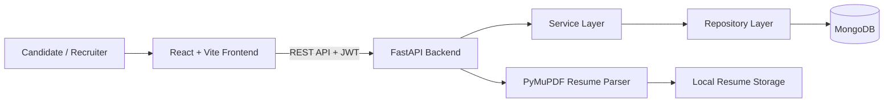

# 🚀 NipunHire AI

> An Explainable AI Platform for Intelligent Resume Screening and Adaptive Interview Assessment.


---

## 📌 Overview

NipunHire AI is a full-stack recruitment and career-growth platform that helps candidates and recruiters manage the hiring journey in one place. It combines PDF resume analysis, transparent ATS-style scoring, skill-gap matching, job and application tracking, interview workflows, and career-development tools.

The platform focuses on **explainability**. Rather than returning only an opaque score, it shows the extracted skills, matched and missing job requirements, quality breakdown, strengths, weaknesses, and actionable recommendations.

### 🎯 Objectives

- Make resumes easier to evaluate through structured PDF parsing and ATS-style feedback.
- Help candidates understand their fit for a role through clear skill-gap analysis.
- Give recruiters a central workspace for jobs, candidates, applications, and interview activity.
- Support candidate development through goals, coding practice, notifications, and career coaching.

> **Note:** The current analysis engine uses transparent rule-based scoring and matching. The backend is configured for future Gemini/OpenAI integrations, but API keys are not required for the current core workflows.

---

## ✨ Features

### 🔐 Authentication and Account Management

- User registration and login
- JWT access-token and refresh-token workflow
- Protected frontend routes and authenticated API endpoints
- Profile editing, password changes, and account settings

### 📄 Resume Intelligence

- Upload and store PDF resumes
- Extract PDF text and page count with PyMuPDF
- Detect email, phone number, and recognised technical skills
- Generate an ATS-style score based on content completeness, keyword density, and formatting signals
- Show missing information, suggested action verbs, and formatting recommendations
- Access resume history and delete uploaded resumes

### 🎯 Job Matching and Skill-Gap Analysis

- Create jobs with required and optional skills
- Compare a candidate resume with a target job
- View matched skills and missing required/optional skills
- Receive match score, application-readiness score, strengths, weaknesses, and recommendations
- Keep scoring transparent and explainable for human review

### 💼 Recruitment Workflow

- Create, browse, update, and delete job listings
- Submit and track applications across the hiring process
- Candidate screening and match-card interface
- Role-aware recruiter/candidate dashboards
- Analytics and recruitment pipeline view
- Create, list, and submit interview workflows

### 📈 Career Growth Workspace

- Career goals and progress tracking
- Coding-question and submission workflow
- Career-coach Q&A with saved history
- Notification centre with unread tracking and bulk actions

---

## 🛠 Tech Stack

| Category | Technologies | Usage |
| --- | --- | --- |
| **Frontend** | React 19, TypeScript, Vite | Single-page web application |
| **UI & Styling** | Tailwind CSS, Base UI, Lucide React, Sonner | Responsive design, reusable components, icons, notifications |
| **Frontend Data** | TanStack React Query, Zustand, Axios | Server-state caching, auth state, API requests |
| **Backend** | Python 3.14, FastAPI, Pydantic | Async REST API and request/response validation |
| **Database** | MongoDB, Motor, Beanie | Async document persistence and models |
| **Authentication** | JWT, Passlib, bcrypt, python-jose | Secure password hashing and token-based access |
| **Resume Processing** | PyMuPDF, regular expressions | PDF extraction and structured resume analysis |
| **Development** | npm, Vite, TypeScript, uvicorn | Frontend tooling and local API server |

---

## 📂 Project Structure

```text
hiresense/
├── README.md
├── pyproject.toml
├── uv.lock
├── research data/                 # Research papers and references
└── hireSence AI/
    ├── backend/
    │   ├── .env.example           # Backend environment template
    │   └── app/
    │       ├── api/               # FastAPI endpoint modules
    │       ├── core/              # Configuration, security, dependencies
    │       ├── db/                # MongoDB setup
    │       ├── models/            # Beanie document models
    │       ├── repositories/      # Database access layer
    │       ├── schemas/           # Pydantic request/response contracts
    │       └── services/          # Business logic and resume processing
    ├── frontend/
    │   ├── public/                # Static assets
    │   ├── src/
    │   │   ├── app/               # Routing and providers
    │   │   ├── features/          # Feature-based pages and components
    │   │   └── shared/            # Shared UI, API clients, utilities
    │   └── package.json
    └── requirements.txt
```

### 🏗 Architecture



The backend is organised into API routers, services, repositories, models, and schemas. This separation keeps request handling, business logic, database access, and validation easier to maintain and test.

---

## 🚀 Getting Started

### Prerequisites

- Python 3.14+
- Node.js 20+ and npm
- MongoDB (local or hosted)
- Git

### 1. Clone the repository

```bash
git clone <your-repository-url>
cd hiresense
```

### 2. Configure the backend

```bash
cd "hireSence AI"
python -m venv .venv
```

Activate the virtual environment:

```bash
# Windows PowerShell
.venv\Scripts\Activate.ps1

# macOS / Linux
source .venv/bin/activate
```

Install dependencies and copy the environment template:

```bash
pip install -r requirements.txt

# Windows PowerShell
Copy-Item backend/.env.example backend/.env

# macOS / Linux
cp backend/.env.example backend/.env
```

Update `backend/.env` with secure values:

```env
MONGODB_URI=mongodb://localhost:27017
DATABASE_NAME=hiresense_ai
JWT_SECRET=replace_with_a_long_random_secret
ALLOWED_ORIGINS=["http://localhost:5173"]
```

Start the FastAPI server:

```bash
cd backend
uvicorn app.main:app --reload
```

The API runs at `http://localhost:8000`.

### 3. Configure the frontend

Open a new terminal in `hireSence AI/frontend`:

```bash
npm install
```

Create `frontend/.env`:

```env
VITE_API_BASE_URL=http://localhost:8000/api/v1
```

Start the frontend:

```bash
npm run dev
```

Vite normally serves the application at `http://localhost:5173`.

---

## 📖 Documentation

### API Documentation

After starting the backend, FastAPI automatically provides interactive API documentation:

| Resource | URL |
| --- | --- |
| Swagger UI | `http://localhost:8000/docs` |
| ReDoc | `http://localhost:8000/redoc` |

All API routes use the `/api/v1` prefix. Authenticated endpoints require an `Authorization: Bearer <access-token>` header.

### API Modules

| Module | Base path | Purpose |
| --- | --- | --- |
| Authentication | `/auth` | Register, login, refresh tokens, account information |
| Jobs | `/jobs` | Job creation and management |
| Resumes | `/resumes` | PDF upload, analysis, history, deletion |
| Matching | `/matching/compare` | Resume-to-job skill-gap report |
| Applications | `/applications` | Application creation, status updates, listing |
| Profile and Settings | `/profile`, `/settings` | Candidate profile and account preferences |
| Dashboard | `/dashboard` | Candidate dashboard data |
| Interviews | `/interviews` | Interview creation, listing, submission |
| Goals | `/goals` | Career goals and progress |
| Coding | `/coding` | Coding questions and submissions |
| Coach | `/coach` | Career-coach requests and history |
| Notifications | `/notifications` | Notification read and unread state |

### How the Analysis Works

1. A candidate uploads a PDF resume.
2. PyMuPDF extracts text and the page count.
3. The parser identifies contact information and skills from a technical-skills dictionary.
4. The ATS-style score combines completeness, keyword density, and formatting indicators.
5. For a job comparison, the service compares extracted resume skills against required and optional job skills.
6. The application returns an explainable report with scores, gaps, strengths, weaknesses, and recommendations.

> Scores are decision-support signals only. Human review must remain part of every hiring decision.

### Development Commands

| Directory | Command | Description |
| --- | --- | --- |
| `hireSence AI/frontend` | `npm run dev` | Start the frontend development server |
| `hireSence AI/frontend` | `npm run build` | Type-check and create a production build |
| `hireSence AI/frontend` | `npm run lint` | Run frontend linting |
| `hireSence AI/backend` | `uvicorn app.main:app --reload` | Start the backend in development mode |

---

## 🧪 Research

The `research data/` directory contains reference material used while designing the platform's recruitment, resume-screening, and AI-assistance workflows.

Current research direction includes:

- Explainable decision support in recruitment systems
- Resume parsing and ATS compatibility evaluation
- Fairness, privacy, and human oversight in AI-assisted hiring
- Semantic skill matching and adaptive interview assessment

---

## 🗺 Roadmap

- [x] FastAPI backend with MongoDB persistence
- [x] React/Vite frontend with protected routes
- [x] Authentication and profile management
- [x] Job management, applications, and candidate matching
- [x] PDF resume parsing and ATS-style scoring
- [x] Interview, goals, coding, coaching, and notifications modules
- [ ] Automated backend and frontend test suites
- [ ] CI/CD pipeline
- [ ] Production deployment configuration
- [ ] Managed object storage for uploaded resumes
- [ ] LLM-powered analysis with evaluation, guardrails, and monitoring
- [ ] Advanced semantic matching and recruiter reporting

---

## 🤝 Contributing

Contributions are welcome.

1. Fork the repository.
2. Create a feature branch: `git checkout -b feature/your-feature`.
3. Make and test your changes.
4. Commit with a clear message.
5. Open a pull request explaining the change and how it was tested.

Please do not commit `.env` files, API keys, JWT secrets, private resumes, or other personal candidate data.

---

## 📜 License

Licensed under the Apache License 2.0.
